# Dashchan [redacted]

Android client for imageboards.

> [!IMPORTANT]
> **Dashchan [redacted] runs on Android 16 or newer only.** Devices on older
> Android versions are not supported and cannot install the app.

A fork of [TrixiEther/DashchanFork](https://github.com/TrixiEther/DashchanFork),
itself a fork of [Mishiranu/Dashchan](https://github.com/Mishiranu/Dashchan).

## Features

### Browsing

* Supports many imageboards through installable extensions
* Fullscreen layout with configurable themes
* Thread watcher with reply notifications
* Automatic post filtering using regular expressions
* Hide threads with a swipe
* Your posts and replies to them are highlighted and marked on the scrollbar
* Thread archiving in HTML format

### Media

* Built-in image gallery and video player — no separate video player extension needed
* Picture-in-picture video playback with a video feed mode
* Optional multi-threaded video playback for better performance
* Reverse image search, including Google Lens

### Posting

* Voting on boards that support it (for example 2ch.hk/news/, requires an updated extension)
* Captcha timer with automatic reload on imageboards that support it
* Smarter image attaching: remembers your settings, lets you rename files

Version history with changelogs lives in [metadata/versions.json](metadata/versions.json)
and [metadata/en/changelogs](metadata/en/changelogs).

## Screenshots

<p>
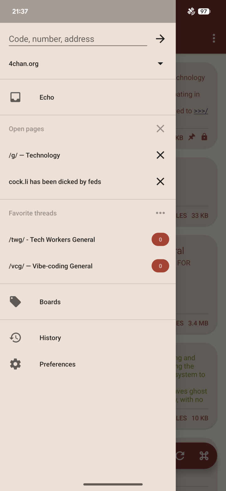
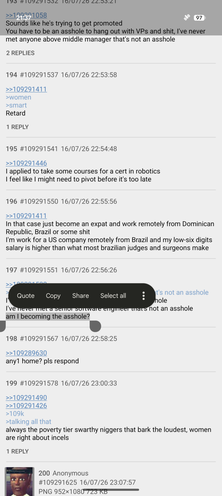
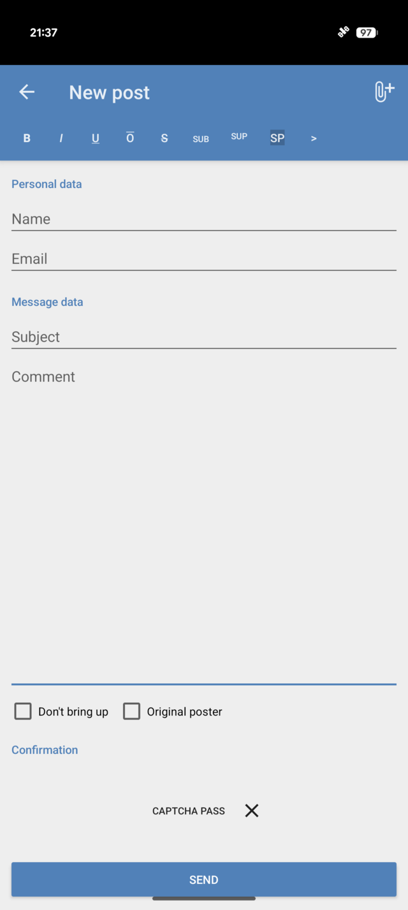
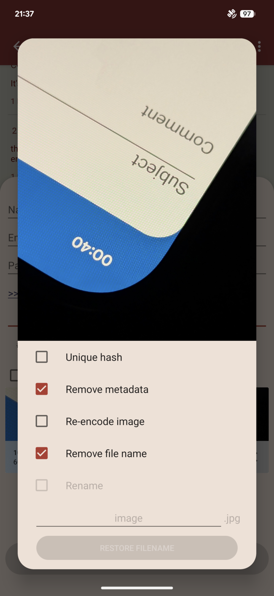
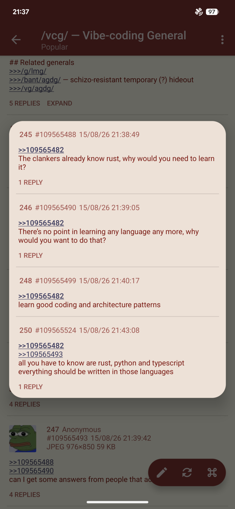
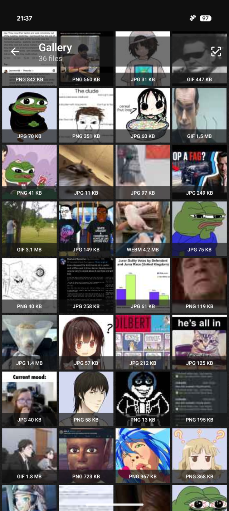
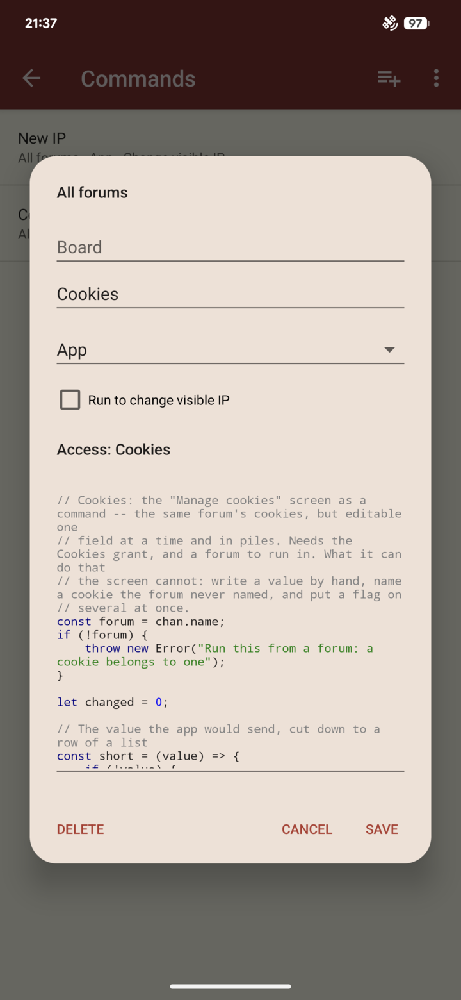
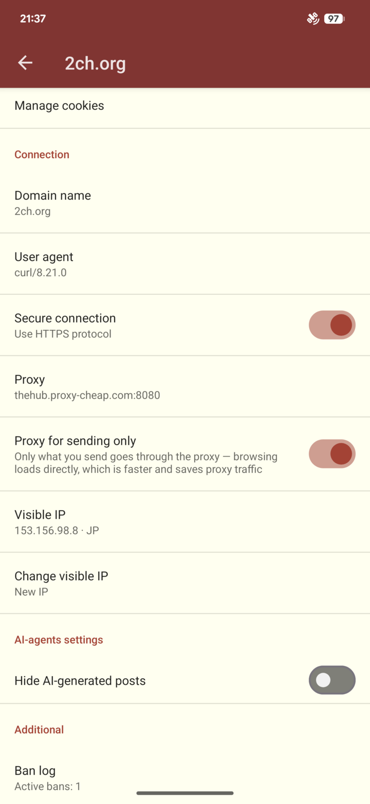
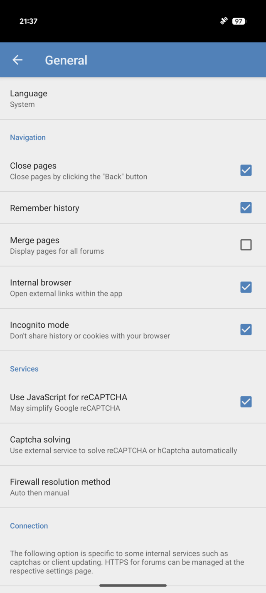
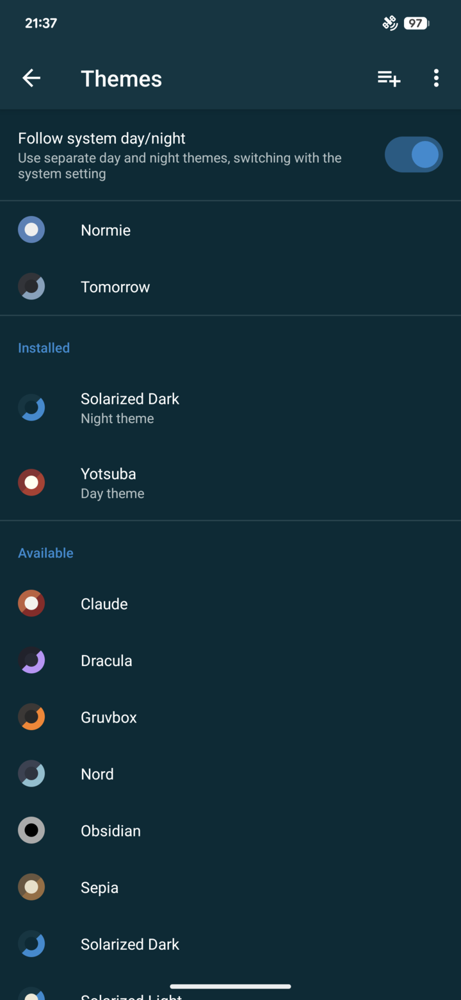
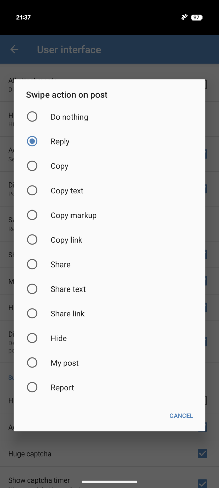
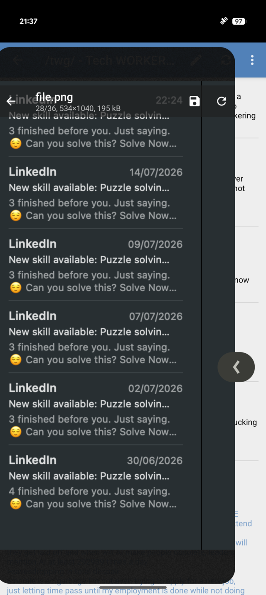
</p>

## Building Guide

1. Install JDK 17 or higher
2. Install Android SDK, define `ANDROID_HOME` environment variable or set `sdk.dir` in `local.properties`
3. Run `./gradlew assembleRelease`

The resulting APK file will appear as `build/outputs/apk/release/dashchan-redacted-release.apk`.

### Build Signed Binary

You can create `keystore.properties` in the source code directory with the following properties:

```properties
store.file=%PATH_TO_KEYSTORE_FILE%
store.password=%KEYSTORE_PASSWORD%
key.alias=%KEY_ALIAS%
key.password=%KEY_PASSWORD%
```

Without it, release builds are signed with the debug keystore.

### Building Extensions

The source code of extensions is available in the
[dashchan-redacted/extensions](https://github.com/dashchan-redacted/extensions) repository;
the original is
[Mishiranu/Dashchan-Extensions](https://github.com/Mishiranu/Dashchan-Extensions).

## License

Dashchan [redacted] is available under the [GNU General Public License, version 3 or later](COPYING).
