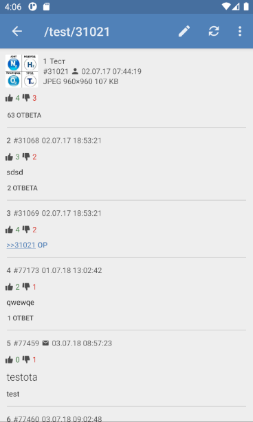
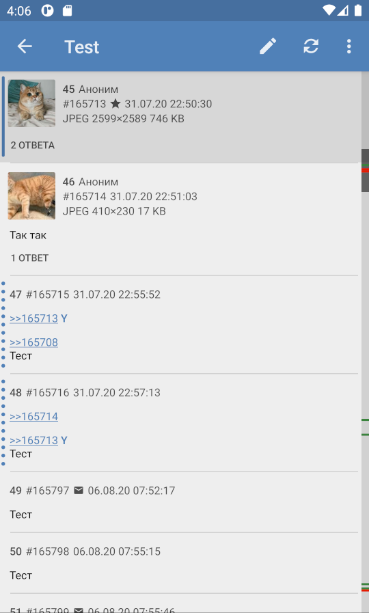
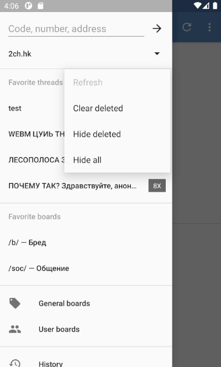
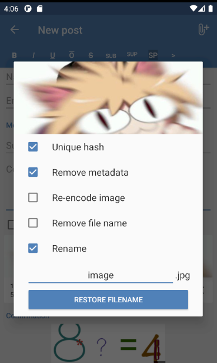
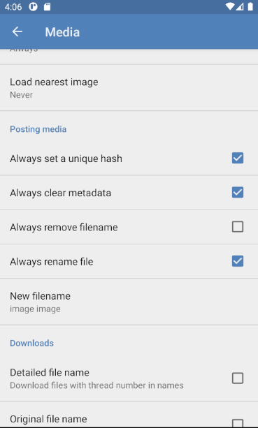

# Dashchan (pixel fork)

Android client for imageboards.

A fork of [TrixiEther/DashchanFork](https://github.com/TrixiEther/DashchanFork),
itself a fork of [Mishiranu/Dashchan](https://github.com/Mishiranu/Dashchan).

## Features

* Supports multiple forums using extensions
* Threads watcher and reply notifications
* Automatic filter using regular expressions
* Image gallery and video player
* Picture-in-picture video playback
* Archiving in HTML format
* Configurable themes
* Fullscreen layout

## Screenshots

<p>







</p>

## Changes over the original Dashchan

* Support for voting on boards that provide it, for example 2ch.hk/news/ (requires an updated extension)
* Hiding threads with a swipe (activated in the settings)
* Fixed app freezes while downloading when the download folder contains many files
* Reworked ClickableToast, may fix display on some Android systems
* Google Search now uses Google Lens
* Optional multi-threaded video playback (may improve performance)
* Captcha timer support with automatic reload for imageboards that support it
* Hiding the list of favorite threads
* Interface improvements: border highlight for your posts, your posts and replies marked on the scrollbar
* Additional functionality when attaching pictures (remembering settings, renaming a file)
* Picture-in-picture video playback with a video feed mode

Version history with changelogs lives in [metadata/versions.json](metadata/versions.json)
and [metadata/en-US/changelogs](metadata/en-US/changelogs).

## Building Guide

1. Install JDK 17 or higher
2. Install Android SDK, define `ANDROID_HOME` environment variable or set `sdk.dir` in `local.properties`
3. Run `./gradlew assembleRelease`

The resulting APK file will appear as `build/outputs/apk/release/dashchan-pixel-release.apk`.

### Build Signed Binary

You can create `keystore.properties` in the source code directory with the following properties:

```properties
store.file=%PATH_TO_KEYSTORE_FILE%
store.password=%KEYSTORE_PASSWORD%
key.alias=%KEY_ALIAS%
key.password=%KEY_PASSWORD%
```

Without it, release builds are signed with the debug keystore.

### Building Extensions

The source code of extensions is available in the
[TrixiEther/Dashchan-Extensions](https://github.com/TrixiEther/Dashchan-Extensions) repository
(the fork with new modules and included updates); the original is
[Mishiranu/Dashchan-Extensions](https://github.com/Mishiranu/Dashchan-Extensions).

The video player libraries are built into the client in this fork and no longer
require a separate extension.

## License

Dashchan is available under the [GNU General Public License, version 3 or later](COPYING).
